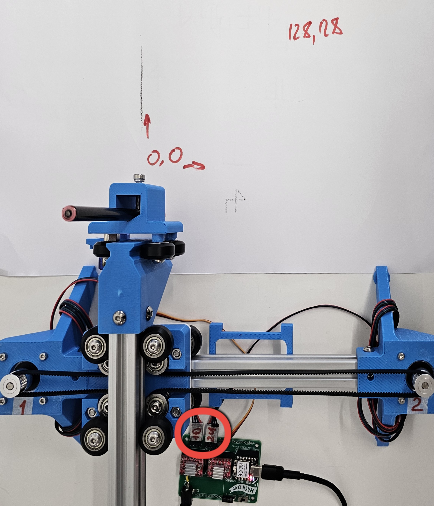

FabLab makes Blot - an open-source, browser-coded plotter by Hack Club :)

See [here](./README-orig.md) for the original project README file.

# Challenges / To Do List:
Most of the initial project challenges come from not having an original kit of parts and having to fabricate or source them directly. To begin to able to build the project, we aim to:

- source all parts on AliExpress (apart from the custom control and power boards)
- DONE: rework the control board as a through hole KiCad project (it's currently done in EasyEda as PCBA). Can be found [here](./hardware/motor-control-board/circuit/controller_Kicad)
- have the power board made as fully assembled (PCBA)
- CNC mill the aluminium part

# Notes
- For USB-C Connector I used part no. MC-311D - though not correctly placed
- For Diode I used part no. BZT52B15S RRG
- for more info on power/control boards check [README](./hardware/motor-control-board/README.md) from hardware folder

## Blot Control Board v1.0
In order to make stepper motors function with the control board v1.0, their pins 2 and 3 must be swapped, ie instead of 1-2-3-4 both motors should be connected as 1-3-2-4.

Different combinations of motor-board connections result in origin point of canvas (0,0) being rotated 90-270 degrees and one or both axes being flipped. Motors are marked 1 and 2, and their connectors are 1U/1D and 2U/2D respectively. One of the proper (unflipped) options is shown on the image (1D left and 2U right).

